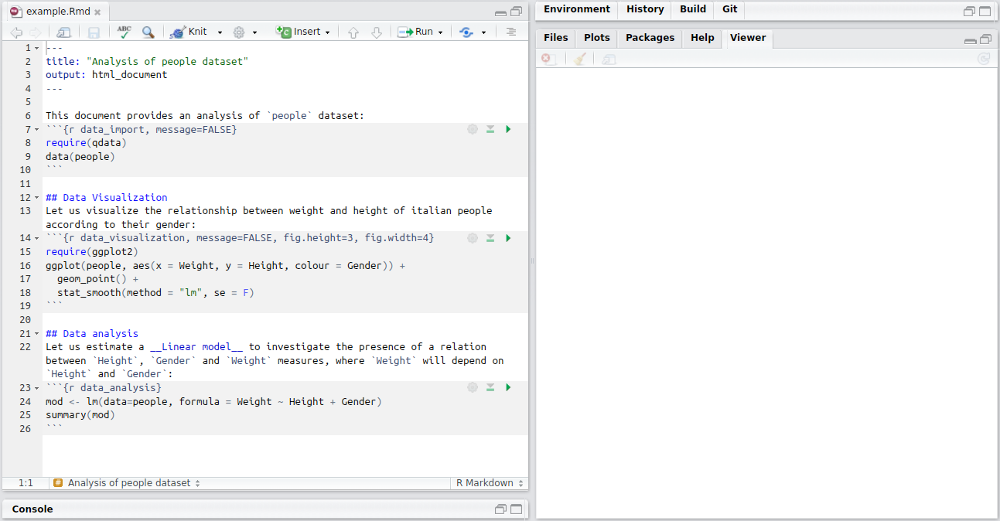
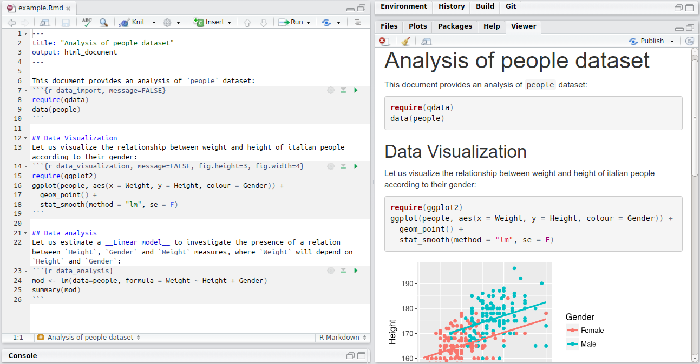
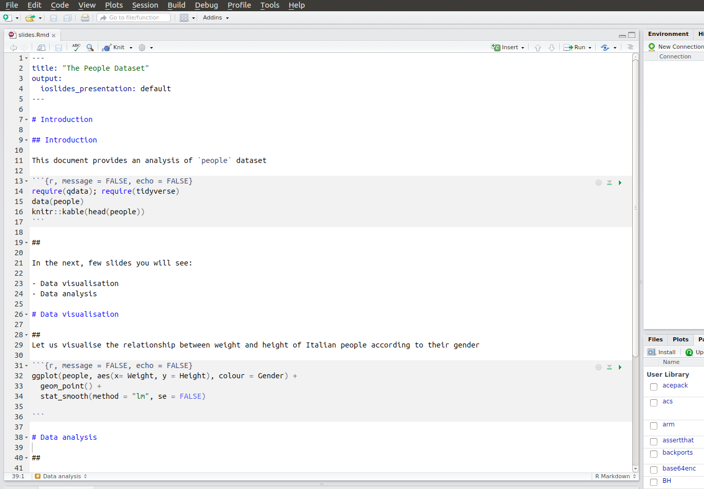

```{r setup, include=FALSE}
knitr::opts_chunk$set(echo = TRUE)
```


## rmarkdown {.columns-2 .smaller}

{width=75%}


R Markdown provides an authoring framework for data science. 

R Markdown allows us to turn our analysis into high quality documents, reports, presentations and dashboards. 

We can use a single R Markdown file to both:

* save and execute code
* generate high quality reports that can be shared with an audience


## Markdown Basics

R Markdown: plain text file that has the extension `.Rmd`:



## Markdown Basics

Notice that the file contains three types of content:

* An (optional) YAML header surrounded by `---`
* R code chunks surrounded by ` ``` `
* text mixed with simple text formatting

Markdown is a simple formatting language designed to make authoring content easy for everyone. 


## Basic rules 


`*italic*`  `**bold**`  
*italic*   **bold**

`_italic_`   `__bold__ `  
_italic_   __bold__ 

You may also add colourful text:

`This is <span style="color:red"> coloured </span>`

This is <span style="color:red"> coloured </span>


## Headers

To indicate titles of sections according to their hierarchy:

`# Header 1`       

`## Header 2`      

`### Header 3`     


## item lists

To create a list of items:

* Unordered List:
  
`* Item 1`  
`* Item 2`  
    `+ Item 2a`  
    `+ Item 2b`    
  
  
* Item 1
* Item 2
    + Item 2a
    + Item 2b  

## item list

* Ordered List:

`1. Item 1`  
`2. Item 2`  
`3. Item 3`  
    `+ Item 3a`  
    `+ Item 3b`  

1. Item 1
2. Item 2
3. Item 3
    + Item 3a
    + Item 3b   
    

## Links

To add an http address or a link to a phrase:

`http://example.com`  
http://example.com  

`[linked phrase](http://example.com)`  
[linked phrase](http://example.com)  


## Images

To add an images on the web or local files in the same directory:

``

``

`[alt text]` specifies the text to be inserted if the image is not displayed.


## Inline Code

To include code out of the chunk, you have to enclose it in back-ticks:  

We defined the \` add \` function to  compute the sum of two numbers.  

We defined the ` add ` function to  compute the sum of two numbers. 


## Tables

If you want to create a table, you have to follow the the syntax:

`First Header  | Second Header`    
`------------- | -------------`    
`Content Cell  | Content Cell`    
`Content Cell  | Content Cell`    
    

First Header  | Second Header  
------------- | -------------  
Content Cell  | Content Cell  
Content Cell  | Content Cell


## Manual Line Breaks

To create a line breaks, you have to end a line with two or more spaces:

Roses are red,  
Violets are blue.


## Rendering Output

To generate a report from the file, run the `render` command:

```{r eval=FALSE}
require(rmarkdown)
render("example.Rmd")
```

Otherwise, use the "Knit" button in the RStudio IDE to render the file and preview the output with a single click or the keyboard shortcut _Ctrl + Shift + K_.



R Markdown generates a new file that contains selected text, code, and results from the .Rmd file. The new file can be a finished web page, PDF, MS Word document, slide show, notebook, handout, book, dashboard, package vignette or other format.


## Code chunk options

Control code echo If you are taking notes or you are writing a manual for other R users, you may sometimes want to show the code along with the output and some other times you may want to show just the output or the code. For example if you are creating a report, you may want to hide the code and only show the output. This can be achieved by modifying the chunk options. Below is a list of useful chunk options:

* _Hide code_: for hiding code, you just need to add to your code chunk ``{r, echo = FALSE}``

* _Hide output_: if you want to show the outuput but not the code, add the option ``{r, echo = FALSE}``

* _Hide messages_: messages, for example packages loading meessages, may be hidden by using the option ``{r, message = FALSE}``

* _Hide warnings_: the printing of warnings can be hidden by using the option ``{r, warning = FALSE}``

* _Hide code and results_: if you want to hide both code and results, you may use ``{r, include = FALSE}``


## Building presentations

Presentation from R Markdown:  ioslides or pdf slides



