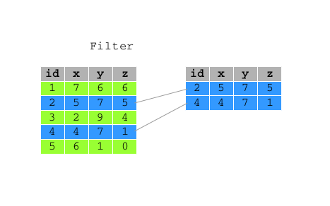

```{r setup, include=FALSE}
knitr::opts_chunk$set(echo = TRUE)
```


## Data Manipulation {.columns-2 .smaller}
{width=75%}

<p class="forceBreak"></p>

* Data Manipulation 
* Package `dplyr` 
* Part of `tidyverse`

# intro

## `dplyr`

* Simplifies how you think about common data manipulation tasks
* Provides simple "verbs", functions that correspond to the most common data manipulation tasks
* Uses efficient data storage back-ends

## Load Tidyverse 

Do not forger to load `tidyverse` and set `options()`

```{r, message = FALSE}
require(tidyverse )
require(knitr)
options(tibble.print_max = 5, tibble.print_min = 5)
```


# %>% 


## Pipe operator  `%>%` 

* The pipe operator (`%>%`) pipes the output from one function to the input of another function. 

* The idea of piping is to read the functions from left to right. 

* It is particularly useful with nested functions 


## Pipe operator  `%>%` 

* The `mpg` data set, included in `ggplot2` package, contains information about various cars attributes: 

* Function `head` returns the top rows of a tibble


```{r pipe1}
head(mpg)
```

## Pipe operator  `%>%` 

By using `%>%`, the code becomes:

```{r pipe2}
mpg %>% head()
```

##  Pipe operator  `%>%` 

* `%.%` takes the argument on the left: `mpg` and passes it to the function on the right: `head()` 

* You don't need to write the first argument of the function. 

* Other arguments of the function can be added to the function as usual 

* By default `head()` prints the first 6 rows of the tibble. In order to print the first two rows

```{r pipe3}
mpg %>% head(n=2)
```


# dplyr

## dplyr 

`dplyr` functions  allow you to solve the vast majority of data manipulation challenges

`dplyr` is made of five key functions

* Pick observations by their values `filter()`
* Reorder the rows `arrange()`
* Pick variables by their names `select()`.
* Create new variables with functions of existing variables `mutate()`
* Collapse many values down to a single summary `summarise()`

These can all be used in conjunction with `group_by()` which changes the scope of each function from operating on the entire dataset to operating on it group-by-group. 


## dplyr 

These six functions provide the verbs for a language of data manipulation.

All verbs work similarly:

The first argument is a tibble

The subsequent arguments describe what to do with the tibble, using the variable names (without quotes).

The result is a new tibble.

Together these properties make it easy to chain together multiple simple steps to achieve a complex result

# select

## select

* `select()` allows you to rapidly zoom in on a useful subset of columns.  
* `select()` is a `dplyr` function. 
* `dplyr` is part of `tidyverse`

 


## Load Tidyverse 

Do not forger to load `tidyverse` and set `options()`

```{r, , message = FALSE}
require(tidyverse )
```


```{r}
options(tibble.print_max = 5, tibble.print_min = 5)
```

## select 

Select a subset of columns

The first argument is the name of the data frame, and the second and subsequent are the name of column/s you want to select:


```{r select2}
select(mpg, manufacturer,model,year ) 
```


## select 

Use `%>%` operator 

```{r select3}
mpg %>%  select(manufacturer,model,year )
```

## select 

Select multiple adiacent columns

```{r}
mpg %>%  select ( manufacturer:year)
```

## select 

Remove single variable 

```{r}
mpg %>%  select ( -class)
```

## select 

Remove more than one variable 

```{r}
mpg %>%  select (- c(year, class)) 
```


## select 

Use some tidy select syntax 

```{r}
mpg %>%  select ( starts_with('m'))
```

## rename

Rename variables with `select()`

```{r }
mpg %>% select(brand = manufacturer )
```

## rename 

Even `rename()` works

```{r }
mpg %>% rename ( brand = manufacturer )
```


## rename all 

Rename all columns

```{r}
mpg %>% rename_all(toupper)
```


# filter 


## Load Tidyverse 

Do not forger to load `tidyverse` and set `options()`

```{r, , message = FALSE}
require(tidyverse )
```


```{r}
options(tibble.print_max = 5, tibble.print_min = 5)
```


## filter

`filter()` allows you to select a subset of the rows of a data frame.

 


## filter 

The first argument is the name of the tibble, and the second and subsequent are filtering expressions evaluated in the context of that tibble.

All cars made by subaru:


```{r }
filter(mpg, manufacturer == 'subaru')
```

## filter 

`filter()` allows you to give it any number of filtering conditions which are joined together with `&` operator  

All cars made by subaru of class suv 

```{r }
mpg %>% filter(manufacturer == 'subaru', class == 'suv') 
```

Note the use of `%>%` operator 

## filter 

All cars with displ > 6

```{r}
mpg %>% filter(displ> 6)
```


## filter 

Using `or` condition 

```{r}
mpg %>% filter(manufacturer == 'subaru', displ> 7 | class == 'suv')
```


## filter 

Use `filter()` in conjunction  with `%in%` 

```{r }
mpg %>% filter(year %in% c(2008, 2009), manufacturer == 'audi' )
```


## filter 

Use `filter()` with `|` (or) operator 


```{r}
mpg %>% filter(manufacturer == 'subaru' | class == 'suv')
```


## filter 

Use `filter()` with between 

```{r}
mpg %>% filter(between(displ  , 6, 7))
```


## dynamically

Use `filter()` dynamically


```{r}
mpg %>% filter(displ  == max(displ))
```


## dynamically 

Use `filter()` dynamically

```{r}
mpg %>% filter(displ  >= quantile(displ, .99))
```

# arrange


## arrange

* Function `arrange()` reorders a tibble by one or more variables. 


## arrange

Order by year 

```{r}
mpg %>% arrange(year)
```

## arrange

Order by displ within manufacturer 

```{r}
mpg %>% arrange(manufacturer, displ)
```


## arrange

Descending order 

```{r}
mpg  %>% arrange(desc(year))
```


## arrange

Descending order 

```{r}
mpg  %>% arrange(desc(manufacturer, year))
```


# summarise

## summarise

`summarise()`, collapses a data frame to a single row according to any aggregating function 
 
`summarise()` is `n => 1` transformation  

## summarise

Single aggregating function 

```{r}
mpg  %>% summarise(avg_displ = mean(displ))
```


## summarise

Multiple aggregating functions 

```{r}
mpg  %>% summarise(min_displ = min(displ),
                   max_displ = min(displ))
```


## summarise

Modern versions of `dplyr` allow `n => m ` tranformation:

```{r}
mpg  %>% summarise(q_displ = quantile(displ , prob = c(.25, .5, .75)))
```

# chain 


## chain 

`dplyr` functions can be chained together 

simple steps can be combined together to achieve complex results 


## chain

Average displacements for Pacific cars by type of drive train 

```{r}
mpg %>% 
  filter (manufacturer %in% c('subaru', 'toyota', 'nissan')) %>% 
  group_by(drv) %>% 
  summarise(avg_cty = mean(cty), .groups = 'drop') %>% 
  mutate(manufacturer = 'pacific') %>% 
  select(manufacturer, everything())
```

## chain

Average hwy for top three city fuel consumer by manufacturer 

```{r}
mpg %>% 
  arrange(manufacturer, cty) %>% 
  group_by(manufacturer) %>% 
  slice(1:3) %>% 
  summarise(avg_hwy = mean(hwy), .groups = 'drop')
```


# group by


## group_by

`dplyr` functions become really powerful when combined  with  `group_by`

`group_by` transforms any tibble into a groupped tibble

`group_by` applies verb functions separately onto groups of observations


## group_by

Summarise 

```{r}
mpg %>% 
  group_by(manufacturer) %>%
  summarise( avg_displ = mean(displ),
             avg_cty = mean(cty), 
             n = n(),
             .groups = 'drop')
```


## group_by

Filter 

```{r}
mpg %>% 
  group_by(manufacturer) %>%
  filter( displ == max(displ)) 
```

## group_by

Arrange

```{r}
mpg %>% 
  group_by(drv) %>%
  arrange( cty) 
```


## group_by

Mutate

```{r}
mpg %>% 
  group_by(manufacturer) %>%
  mutate(avg_dspl = mean(displ)) 
```


