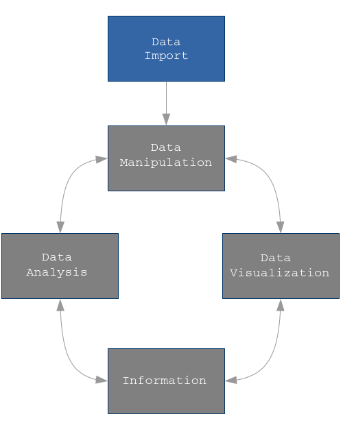

```{r setup, include=FALSE}
knitr::opts_chunk$set(echo = TRUE)
```

<p class="forceBreak"></p>

* Data Import 
* Package `readr`, `readxl` 
* Part of `tidyverse`

# intro

## `readr`

* Provides a tidy interface to import text files into R 

Resources

* https://r4ds.had.co.nz/data-import.html

## Load Tidyverse 

Do not forger to load `tidyverse` and set `options()`

```{r, message = FALSE}
require(tidyverse )
require(knitr)
options(tibble.print_max = 5, tibble.print_min = 5)
```
## Data Import  {.columns-2 .smaller}

{width=75%}

Data Sources

* text files
* xls and xlsx files
* R data files
* Database sources

## know your enemy

* Data import is a crucial phase during any data science project. 

* Despite the apparent job simplicity, and it is simple, it can be frustrating and time consuming.

* Most problems occur as we are not in advance aware of data structure and details. 

* Being able to use bash tools like `wc -l` ,`grep`, `sed`, `vi` etc helps a lot 

* Avoid xls and xlsx format as much as you can 


# Text files


## Tabular files

Importing text files is usually about importing rectangular data structure where:

* each row is an observation 
* each column a variable 
* variables are separated by a delimiter: `[, ; \t etc]`
* first row usually containing variable names. 

```
manufacturer;model;displ;year;cyl;trans;drv;cty;hwy;fl;class;
audi;a4;1.8;1999;4;auto(l5);f;18;29;p;compact
audi;a4;1.8;1999;4;manual(m5);f;21;29;p;compact
audi;a4;2;2008;4;manual(m6);f;20;31;p;compact
```

More complex text files structures exist: fixed width or even more compact layouts but, hopefully, you'll never meet them

## Extensions 

A text file is usually identified by a conventional extension: [`.txt` `.csv`]. 

Extensions are just conventions. 

Changing the extension does not change the file content. Windows associates extensions with specific software:

* `.xlsx` => Excel
* `.csv` => Excel 
* `.txt` => Notepad 

Nevertheless, `.csv` are text files.


## Be smart 

__Be consistent:__

* in your files formats
* in your files naming convention
* in your columns naming convention

__Avoid:__

* blanks in file names and colums names
* capital letters in file names 
* special character in file names except `-` and `_` 
* special character in column names except and `_` 
* no UTF8 characters everywhere
* single quotes and double quotes everywhere


## read_delim 

{width=50%}

Function `read_delim()` imports text files (ASCII) with a table structure field separator where each row represents a case 

Where, text files are usually, but not always, identified by extensions `csv` or `txt`. 

Function `read_delim()` takes at least two arguments:

* file 
* delim 

## read_delim 

File can be either 

* Full path to file: 

```{bash, eval = F}
~/data/file.txt
C:/user/oscar/data/file.txt
```

* Relative path to file 

```{bash, eval = F}
./file.txt
```

Note the use of forward slash `/`. On Windows double back slash `\\` also works 

Delim can be anything like: `,` `;` `|` etc ...


## polymer example

```{r}
polymer <- read_delim ( file = './data/polymer.txt' , delim = ';')
is_tibble( polymer)
```

`read_delim()` import data into a tibble `object`

## polymer example

```{r}
polymer 
```

## column type specification 

Columns data types can, and are better to, be specified in advance

```{r}
polymer <- read_delim ( file = './data/polymer.txt' ,
                        delim = ';',
                        col_types = 'ccccd')
```

Note `date_time` column as character 


## column type specification 

Auto import first

```{r}
polymer <- read_delim ( file = './data/polymer.txt' ,
                        delim = ';',
                        col_types = cols(), 
                        n_max = 10)
```

Check columns specifications  

```{r}
spec(polymer)
```


##   column type specification {.smaller}

The available specifications are: (with string abbreviations in brackets)

* `col_logical() [l]`: containing only T, F, TRUE or FALSE.
* `col_integer() [i]`: integers.
* `col_double() [d]`: doubles.
* `col_character() [c]`: everything else.
* `col_factor(levels, ordered) [f]`: a fixed set of values.
* `col_date(format = "") [D]`: with the locale's date_format.
* `col_time(format = "") [t]`: with the locale's time_format.
* `col_datetime(format = "") [T]`: ISO8601 date times
* `col_number() [n]`: numbers containing the grouping_mark
* `col_skip() [_, -]`: don't import this column.
* `col_guess() [?]`: parse using the "best" type based on the input.


## column name specification 

Columns names can be specified in advance; note `skip = 1`

```{r}
polymer <- read_delim ( file = './data/polymer.txt' , 
                        delim = ';', 
                        skip = 1,
                        col_names = c('date_time','componente' ,
                                      'polimero' ,'misura','valore'))
                        #locale=locale(decimal_mark = "."))
```


# Excel files

## Package readxl

{width=75%}


```{r}
require(readxl)
```

## File Import 

```{r}
iris <- read_excel('./data/flowers.xlsx')
iris
```

## Sheet import 

```{r}
virginica <- read_excel('./data/flowers-2.xlsx', sheet = 'virginica')
virginica
```


# Database 


## Package DBI 

{width=75%}

Package DBI backend for `RSQLite`, `RMySQL`, `RPostgres` ... 

* ODBC
* JDBC
* Native Drivers

## RSQLlite 

`RSQLite` package embeds the `SQLite` database engine in R, providing a DBI-compliant interface. `SQLite` is a public-domain, single-user, very light-weight database engine that implements a decent subset of the SQL 92 standard, including the core table creation, updating, insertion, and selection operations, plus transaction management.  

```{r require_pkg, message=FALSE}
require(RSQLite)
```

## RSQLlite connect 

The function `dbConnect` connect to a SQLite database, or creates it if it doesn't exist:

```{r con_db}
con <- dbConnect(RSQLite::SQLite(), "./data/mtcars.sqlite")
```

## RSQLlite investigate


To see a list of available SQLite tables:

```{r available_tables}
dbListTables(con)
```

or a list of fields in specified table:

```{r table_fields}
dbListFields(con, "mtcars")
```

## RSQLlite getQuery 

The function `dbGetQuery` send query, retrieve results and then clear result set:

```{r query}
dbGetQuery(con, "SELECT * FROM mtcars WHERE cyl = 4")
```


## RSQLlite getQuery 

The next function mimics its R counterpart `get`, except that it generates code that gets remotely executed in a database engine:

```{r}
dbReadTable(con, "mtcars")
```


## RSQLlite disconnect


And finally disconnect from the database:

```{r disconnect_to_db_2}
dbDisconnect(con)
```


