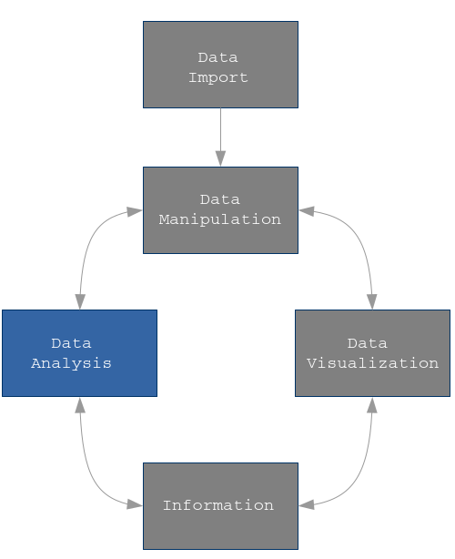

```{r setup, include=FALSE}
knitr::opts_chunk$set(echo = TRUE)
```

<p class="forceBreak"></p>

## Data Modelling {.columns-2 .smaller}
{width=75%}

* Data Modelling 


## References

https://https://r4ds.had.co.nz/model-intro.html


## Load Tidyverse 

Do not forger to load `tidyverse` and set `options()`

```{r, message = FALSE}
require(tidyverse )
require(knitr)
options(tibble.print_max = 5, tibble.print_min = 5)
```

## Models

The goal of a model is to provide a simple low-dimensional summary of a dataset. 

Ideally, the model will

* capture true __signals__: patterns generated by the phenomenon of interest)
* ignore __noise__: random variation 

Two main categories of models

* Predictive => _supervised_:  generate predictions.
* Discovery => _unsupervised_: help discovering relationships within data

## Stat - DM -ML

Data Mining, Statistics and Machine Learning are data driven disciplines

What is the difference between data mining, statistics and machine learning?

__None. They are … concerned with the same question: how do we learn from data?”__

The three disciplines are considerably the same but with minor differences

They can be referred to as identical twins which make use of different words and terminology and follow different notations.


## Regression - Drug  

In an experiment to investigate the effects of a depressant drug, the
reaction times of ten male rats to a certain stimulus were measured
after a specified dose of the drug have been administered to each rat.

```{r}
load('./data/drug.RData')
drug <- as_tibble(drug)

drug
```

## Regression - Discover 

```{r, message=F, warning=F, fig.width = 4, fig.height=3}
pl <- ggplot(data=drug, mapping = aes(x=dose, y=time)) +
  geom_point(color="darkblue", size=2) +
    xlab("dose (mg)") + ylab("reaction time (secs)")
pl 
```


## Regression - Discover 

```{r, message=F, warning=F, fig.width = 4, fig.height=3}
pl <- pl + 
  geom_smooth(method = "lm", colour="red", se = FALSE) 
pl
```


## Regression - Fit 

```{r}
fm <- lm(time ~ dose, data = drug)
summary(fm) 
```


## Regression - Validate

```{r}
par(mfrow = c(2, 2))
plot(fm)
```


## Regression (polyester)

In the study of the polyesterification of fatty acids with glycols, the effect of temperature ($^◦$C) on the percentage conversion of the esterification process was investigated. Data are the results of an experiment using a catalyst of $4 \cdot 10^{−4}$ mole zinc chloride per 100 grams of fatty acid.

```{r}
load('./data/polyester.RData') 
polyester <- as_tibble(polyester)
polyester
```


## Regression - Discover 

```{r, fig.height=3}
pl <-  ggplot(data = polyester, mapping=aes(x = temperature, y=conversion)) +
  geom_point(color="darkblue") + xlab("temperature   (°C)") +
  ylab("percentage conversion (%)")
pl 
```

## Regression - Discover 

```{r, fig.height=3}
pl  <- pl + geom_smooth(method = "lm", colour="red", se = FALSE) + 
  geom_hline(yintercept = mean(polyester$conversion), color = 'green')
pl
```

## Regression - Fit 

```{r}
fm1 <- lm(conversion ~ temperature, data = polyester) 
summary(fm1)
```

## Regression - Validate

```{r}
par(mfrow = c(2,2))
plot(fm1)
```

## Regression

```{r, fig.width = 4, fig.height=3}
polyester %>% 
  mutate(fm1_res = residuals(fm1)) %>% 
  ggplot(mapping=aes(x = temperature, y=fm1_res)) +
  geom_hline(yintercept = 0, color = 'red') +
  geom_point(color="darkblue") + xlab("temperature   (°C)") +
  ylab("Residuals")
```


## Regression - Fit Quadratic 

```{r}
fm2 <- lm(conversion ~ temperature + I(temperature^2) , data = polyester) 
summary(fm2)
```

## Regression - Validate

```{r}
par(mfrow = c(2,2))
plot(fm2)
```

## Regression 

```{r, fig.width = 4, fig.height=3}
polyester %>% 
  mutate(fm2_res = residuals(fm2)) %>% 
  ggplot(mapping=aes(x = temperature, y=fm2_res)) +
  geom_hline(yintercept = 0, color = 'red') +
  geom_point(color="darkblue") + xlab("temperature   (°C)") +
  
  ylab("Residuals")
```


## Logit 

A study to analyze the effect of a toxic product on survival of tobacco _Heliothis Virescens_ budworms.  
Each of 5 different doses of the toxic product has been tested on 20 male 
and 20 female worms to see the survival of worms.

```{r,split=TRUE}

numdead <- c(1, 4 ,9 ,13, 18 ,20, 0, 2, 6, 10, 12, 16)
budworms <- tibble(ldose = rep(0:5, 2),
                   sex = factor(rep(c("M", "F"), each = 6)), 
                   rate = numdead/20)
budworms$SF  <- cbind(numdead, numalive = 20 - numdead)
budworms
```

## Logit 
```{r, message = F, warn = F, fig.width = 5, fig.height=3}
ggplot(data = budworms, mapping = aes(x = ldose, y = rate)) +
  geom_point(size=3, colour="darkblue") + 
  geom_smooth(method = "loess", colour="green",span=1, se = FALSE) +
  facet_wrap(~sex) 
```  


## Logit 

```{r,tidy=FALSE}
fm0 <- glm(SF ~ sex + ldose + sex:ldose, family = binomial(),data = budworms)
summary(fm0)$coefficients
```

## Logit parametrization

```{r,tidy=FALSE}
fm1 <- glm(SF ~ sex + ldose + sex:ldose - 1, family = binomial(),data = budworms)
summary(fm1)$coefficients
```

## Logit Prediction 

```{r,tidy=FALSE}
newdata <- tibble(
  ldose = rep(seq(0, 5, length = 100), 2),
  sex = factor(rep(0:1, each = 100), labels = c("F","M"))
)

newdata <- newdata %>% 
  mutate(pred = predict(fm1, type = "response", newdata = newdata))
```
         
## Logit prediction 

```{r, message = F, warn = F, fig.width = 5, fig.height=4}
ggplot(data = budworms, mapping = aes(x = ldose, y = rate)) +
  geom_point(size=3, mapping = aes(shape=sex, colour=sex)) + 
  geom_line(data=newdata, mapping = aes(x = ldose, y = pred, colour=sex)) +
  theme(legend.position="top")
```

## Classification tree {.smaller}

The aim of this example is to predict the correct specie of iris flowers given their
length and width measures for petals and sepals.  

```{r}
require(rpart)
require(pROC)
require(caret)
iris <- as_tibble(iris)
iris
```

## Classification tree {.smaller}


```{r}
iris_rp <- rpart(Species ~ ., method = "class", data = iris,
								 control = rpart.control(minsplit = 4, cp = 0.000001))
summary(iris_rp)
```


## Classification tree {.smaller}

```{r}
plot(iris_rp, uniform = TRUE, compress = TRUE, margin = 0.2, branch = 0.3)
text(iris_rp, use.n = TRUE, digits = 3, cex = 0.6)
```

```{r}
printcp(iris_rp)
```

## Classification tree {.smaller}

In above table:

- `CP` is the $\alpha$ parameter; 
- `nsplit` is the number of splits of best tree found based on `CP`;
- `rel error` is the relative (resubstitution) prediction error of the selected tree with respect to the "root only" tree; the resubstitution error is calculated on the same data where the tree has been trained.
- `xerror` is the cross-validation error, obtained by splitting the data in `xval` subsets, applying the training procedure iteratively on data where one of the subsets is removed, and then predicting on the removed subset; `xerror` is the mean of `xval` obtained cross-validation errors
- `xstd` is the standard deviation of error estimated via cross-validation


